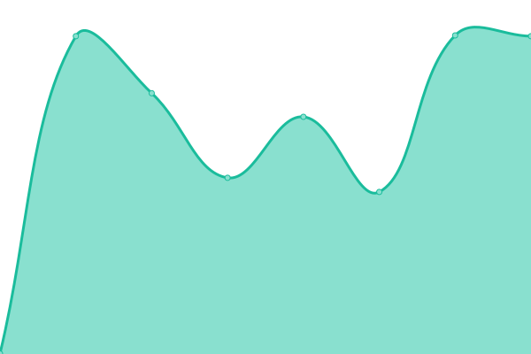

# [📈 Live Status](https://rholak.github.io/upptime): <!--live status--> **🟩 All systems operational**

This repository contains the open-source uptime monitor and status page for [Robert Holak](https://rholak.github.io/upptime), powered by [Upptime](https://github.com/upptime/upptime).

With [Upptime](https://upptime.js.org), you can get your own unlimited and free uptime monitor and status page, powered entirely by a GitHub repository. We use [Issues](https://github.com/rholak/upptime/issues) as incident reports, [Actions](https://github.com/rholak/upptime/actions) as uptime monitors, and [Pages](https://rholak.github.io/upptime) for the status page.

<!--start: status pages-->
<!-- This summary is generated by Upptime (https://github.com/upptime/upptime) -->
<!-- Do not edit this manually, your changes will be overwritten -->
<!-- prettier-ignore -->
| URL | Status | History | Response Time | Uptime |
| --- | ------ | ------- | ------------- | ------ |
|  [This Repo](https://github.com/rholak/upptime/) | 🟩 Up | [this-repo.yml](https://github.com/rholak/upptime/commits/HEAD/history/this-repo.yml) | 

 891ms
     
 | 

<a href="https://rholak.github.io/upptime/history/this-repo">100.00%</a>
    

|  [Status Page](https://rholak.github.io/upptime/) | 🟩 Up | [status-page.yml](https://github.com/rholak/upptime/commits/HEAD/history/status-page.yml) | 

 145ms
     
 | 

<a href="https://rholak.github.io/upptime/history/status-page">100.00%</a>
    

|  BOS | 🟩 Up | [bos.yml](https://github.com/rholak/upptime/commits/HEAD/history/bos.yml) | 

 1648ms
     
 | 

<a href="https://rholak.github.io/upptime/history/bos">100.00%</a>
    

|  BOS2 | 🟩 Up | [bos-2.yml](https://github.com/rholak/upptime/commits/HEAD/history/bos-2.yml) | 

 681ms
     
 | 

<a href="https://rholak.github.io/upptime/history/bos-2">100.00%</a>
    

|  Altor | 🟩 Up | [altor.yml](https://github.com/rholak/upptime/commits/HEAD/history/altor.yml) | 

 307ms
     
 | 

<a href="https://rholak.github.io/upptime/history/altor">100.00%</a>
    

|  [Goog](https://google.com/) | 🟩 Up | [goog.yml](https://github.com/rholak/upptime/commits/HEAD/history/goog.yml) | 

 259ms
     
 | 

<a href="https://rholak.github.io/upptime/history/goog">100.00%</a>
    

|  [Google DNS 1](8.8.4.4) | 🟩 Up | [google-dns-1.yml](https://github.com/rholak/upptime/commits/HEAD/history/google-dns-1.yml) | 

 4ms
     
 | 

<a href="https://rholak.github.io/upptime/history/google-dns-1">100.00%</a>
    

|  [Google DNS 2](8.8.8.8) | 🟩 Up | [google-dns-2.yml](https://github.com/rholak/upptime/commits/HEAD/history/google-dns-2.yml) | 

 4ms
     
 | 

<a href="https://rholak.github.io/upptime/history/google-dns-2">100.00%</a>
    

<!--end: status pages-->

[**Visit our status website →**](https://rholak.github.io/upptime)

## 📄 License

- Powered by: [Upptime](https://github.com/upptime/upptime)
- Code: [MIT](./LICENSE) © [Robert Holak](https://rholak.github.io/upptime)
- Data in the `./history` directory: [Open Database License](https://opendatacommons.org/licenses/odbl/1-0/)
